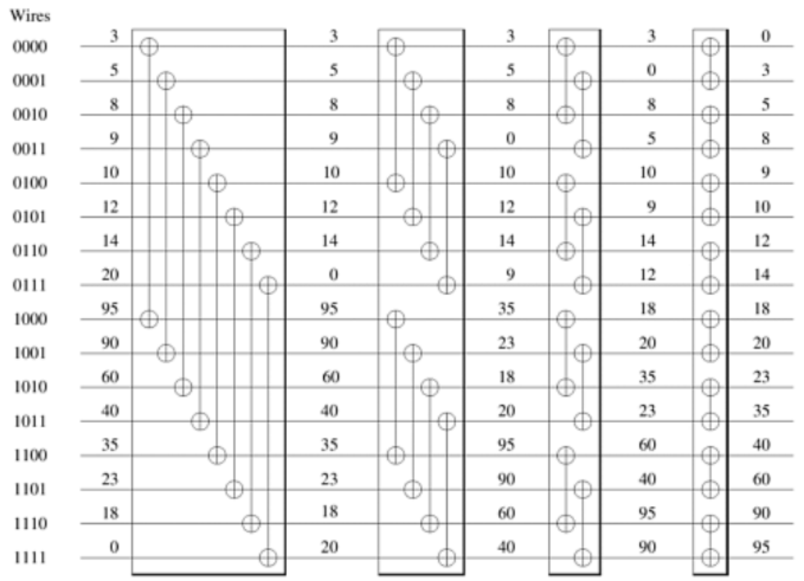

# 双调排序
双调排序是data-independent的排序， 即比较顺序与数据无关的排序方法， 特别适合做并行计算，例如用GPU、fpga来计算。
时间复杂度 O(N * log * logN) 
空间复杂度 O(1) 

## Batcher定理
将任意一个长为2n的双调序列A分为等长的两半X和Y，将X中的元素与Y中的元素一一按原序比较，即a\[i]与a\[i+n] (i < n)比较，将较大者放入MAX序列，较小者放入MIN序列。则得到的MAX和MIN序列仍然是双调序列，并且MAX序列中的任意一个元素不小于MIN序列中的任意一个元素

## 长度为16的双调排序示例图
少了最后一次的排序

----

### v0.1
BitonicSort为单线程实现
BitonicSortMultThread为多线程实现

修改了核心算法
起始下标 = 线程ID % 段数 * 段长 + 组间偏移 + 组内偏移 + 步长

优化了算法，可以完全利用到所有线程
使用CyclicBarrier控制线程同步
当线程数小于等于 段数时，直接使用递归，不进行线程同步。

### 测试结果
环境： jdk1.8  
cpu: i7 4770HQ  四核
带测试数组为 int[] 长度为n的整数次幂

结果：
与jdk Arrays.sort()相比比较
以8线程为例，
- 10w以内长度，耗时为快排10倍(考虑到线程开销较大)
- 10w长度时，耗时可与快排持平，
- 10w~2000w或略慢于快排20%左右
- 6000w以上略高于快排

增加线程数量，性能提升效果指数下降。
排序耗时相对快排非常稳定。
### 结论：
因为双调排序适用于并行计算，单纯时间复杂度是慢于快排，普通cpu核心数量有限，无法完全利用双调排序并行计算，双调排序适用于gpu。

 
-----
ps：
 * 1、数组长度必须为2的整数次幂，未实现padding填充。
 * 2、线程数量也必须为2的整数次幂
 * ~~3、当分段的双调序列数量小于线程数时，未能完全利用线程，待优化。~~
 * ~~4、最后对双调序列进行排序未能利用到多线程，待优化。~~
 * ~~5、不严谨测试,在百万至亿级长度的数组，比Arrays.sort()快排耗时多 0～50%。~~